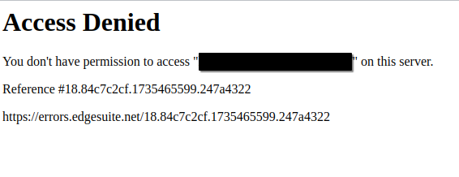

+++
title = 'Fuzzing for Exposed Origin Hosts'
date = 2025-04-08T14:55:06-07:00
ShowToc = true
+++

# Intro

After spending a lot of time staring at this page, I was a little tired of seeing it.  


Over the past few months, I've developed a testing methodology for discovering origin hosts.  
I originally thought that this methodology was just a WAF bypass. However, in the six months it took me to write this up, I've used origin host discovery to find applications with unlisted DNS addresses, to access restricted application paths, and to perform server-side attacks with absolutely no rate limits or content filtering. Since this is a methodology and not a direct vulnerability, the potential uses are limited only by your imagination.

In this blog post I hope to share with you:

1.  A relatively simple way to discover origin hosts
2.  Some ideas on how/when to use it
3.  How to defend against this methodology

## tl;dr

Companies don't restrict traffic to port :443 on edge routing devices, exposing applications and reverse proxies. Fuzz across IP ranges for a known URL to find alternative routes to applications, bypassing cloud protections.

## Overview

Many companies own ranges of public IP addresses, that they assign to cloud and on-premises edge network devices. With modern web application routing, it's common for application paths to be hosted on different servers across the IP ranges.  
By choosing specific paths and locating their network edge, we can access them without their WAF protections.  
In some cases, we can even use this technique to access publicly restricted paths, or FQDNs with unlisted DNS addresses.

There are two main architectures that we'll encounter. Web ports will typically point to either a reverse proxy, or to a web server. I find the reverse proxy situation more interesting, as simple misconfigurations can unintentionally open a path to unlisted FQDNs, or restricted application paths.


## Caveats

Since we'll be manually routing to the edge of the client network, there are some considerations we have to make.

- Read the bug bounty scope page. Make sure that testing against their IP ranges directly does not violate any terms.
- You won't be able to perform any attacks that require a victim to visit the site this way, such as clicking a link.
- Different subdomains/paths might be scattered around the client infrastructure, so you may have to redo this process during testing in order to find different endpoints.
- Your target or endpoint might already have mitigations in place.
- You might hit a reverse proxy or a web application. I usually find reverse proxies to be more interesting, as they can be connected to many web apps and are easily misconfigured.

# Methodology

1.  Identify IP ranges
2.  Choose a URL to look for
3.  Fuzz
4.  Get back to testing

## Part one: Identifying IP ranges

In order to route to the company-owned edge, we first need to differentiate between cloud owned IPs and company owned IPs. The easiest and safest is to pull the IP ranges straight off of the bug bounty scope, or to have the in-scope ranges provided by the client. If you have been provided IP ranges, feel free to skip to the next section.

If that's not an option for you, we can use some of the following methods to locate the IP ranges where applications are hosted. For sites in North America, I will use ARIN to verify ownership and size of the IP range. If you're in the EU, you can use RIPE instead: https://apps.db.ripe.net/  
There are so many ways to discover origin IP ranges, including OSINT tools such as Shodan, Censys, Hackertarget, among others. I'll go over some of my methods below, but use whatever works for you.

### Technique 1 - nslookup

In most cases, this is really only useful to confirm that our target is behind a WAF. You could also use something like wafw00f if you prefer.  
`nslookup <site.com>`

In the output, we can sometimes see immediately that this is behind a cloud WAF:  


Just to prove that this is owned by the WAF vendor, we can search for it in the ARIN database by putting the resolved IP in the search bar: https://www.arin.net/

### Technique 2 - subdomain enumeration

It's common for companies to point fringe subdomains directly to an IP address in their range. These are usually internal or test/pre-prod environments - look for anything that goes against the pattern.  
This method is probably the most likely to provide accurate results, as well as false positives. When sifting through IP addresses, ignore results that mention cloud providers as they are not owned by the target.

`subfinder -d <site.com> | tee subdomains.txt`  
`cat subdomains.txt | httpx -title -status-code -tech-detect -follow-redirects -ports 443 -location -ip`

Once you've identified some IPs that look suspicious, check ARIN again to confirm that they are owned by the target: https://www.arin.net/

### Technique 3 - certificate aliases

Sometimes companies will include server IP addresses as aliases inside of certificates.  
This can be done in a number of different ways, such as inspecting the cert details in your browser or pulling down and decoding each one with openssl.

I have created a simple bash script that will attempt a connection to every site in 'domains.txt', printing DNS and IP aliases in the certificate to the terminal. It is painfully slow.

```cert_scrape.sh
while read domain; do
  echo "Domain: $domain"
  timeout 2 openssl s_client -connect ${domain}:443 -servername ${domain} </dev/null 2>/dev/null | 
    openssl x509 -noout -text 2>/dev/null | 
    grep -A1 "Subject Alternative Name"
done < subdomains.txt
```

*You can also run this script against a range of **IP addresses**, identifying services on each IP*

Don't forget to check ARIN to confirm that they are owned by the target: https://www.arin.net/

### Technique 4 - reverse ARIN/RIPE search

This is a low-confidence way to identify potential ranges - exercise extra caution when looking up ranges this way.  
ARIN has an advanced search, which can identify all the IP ranges that a company owns.  
Remember that ownership does not mean that we are authorized to test against these ranges. For instance telecom providers may own many ranges, some belonging to residential/corporate customers, while some are used for internal services.

https://whois.arin.net/ui/advanced.jsp  
*The search supports wildcards. For example you could search "tesla\*" under "Organization" to see ranges owned by Tesla Motors, Tesla Inc, etc.*  
Once finding the organization, click on "Related Networks"

### Results

At this point, you should have some IP ranges in CIDR notation that looks something like this:

```
123.123.120.0/22
234.234.192.0/18
```

Keep these handy, as we'll need them for part 3.

## Part two: Identify HTTP request for investigation

This part will require a little creativity from the reader. Identify an interesting path (e.g. www.victim.com/path/for/testing) that you want to try out.  
There are so many things you could possibly look for. Fire up your web proxy of choice (Burp Suite/Caido/etc) and start digging!

Some ideas:

- Unreachable hostnames or paths (in the .js files?)
- Injection point where a WAF is blocking your testing
- Path traversal you want to fuzz that has rate limiting

Once you've identified a path you want to test, move on to the next step.

## Part Three: Find origin IP address(es)

What we're doing now is looking for our application path, on all the IP addresses we identified in part 1.

- The first hit on ffuf should be the true domain. It should match what we saw in our web proxy.
- The content length from the true domain should match that of the true request in our proxy.

### Create IP list

Before we can fuzz, we need to create a list of IP addresses to check against. I couldn't find an easy way to do this, so I created a simple tool in go that does this. Feel free to use it, or find another way to turn the IP ranges into a list of IP addresses.

*expand-cidr* installation and usage instructions: https://github.com/syndrome-impostor/expand-cidr

1.  Put all CIDRs you've identified into a file
2.  Turn this into a list of individual addresses `cat cidrs.txt | expand-cidr > ips.txt`
3.  Optional: Append the true domain to the top of ips.txt.  
    *I do this each time I pick a target on a different subdomain. It acts as a canary, proving that our request worked, and giving us a baseline response code/length*

```ips.txt
asdf.example.com
123.123.120.0
123.123.120.1
123.123.120.2
...
```

### Fuzzing!

Now that we know where to look, and what we're looking for, let's get started.  
I'll be using the HTTP request `GET www.victim.com/path/for/testing` in the examples below.

I use the '-timeout' and '-t' (threads) variables to speed up the testing, since most IPs will not reply to our request, and ffuf will patiently wait for responses that aren't coming. This way we only wait 2 seconds max, and run 400 concurrent requests.  
You could also use the `-fs` flag to filter on content size for higher confidence results, if that's your thing.

#### Basic version:

Replace the `/path/for/testing` with your application path, and `www.victim.com` with your desired host.  
`ffuf -w ips.txt -u https://FUZZ/path/for/testing -H "Host: www.victim.com" -timeout 2 -t 400`

If the first request with the true FQDN fails, the most likely culprit is that our ffuf job is using (or not using) some parameters that are causing our request to not reach the destination server.  
A relatively easy method to fix the request is shown in the "Stubborn version" section below.

#### Stubborn version:

- From burp/caido: "Copy as cURL"  
    *This will copy all the headers and cookies, which can help bypass anti-bot protections*
- Change `curl -k` to `ffuf -w ips.txt -u`
- Replace the FQDN in the URL with `FUZZ`
- Add the timeouts and threads `-timeout 2 -t 400`  
    When you're done, it should look something like this:  
    `ffuf -w ips.txt -u https://FUZZ/path/for/testing -H $'Host: www.victim.com' -H $'Connection: keep-alive' -H $'Cookie: cookie1=asdf; cookie2=qwer' -timeout 2 -t 400`  
    *If you want, you can also filter by content-length (`-fs <bytes>`) of the response to only see results that exactly match the expected content-length.*

#### Results

Your ffuf output should look similar to this:


Each request that matches your canary request, should be a route to your application!

## Part Four: Back to testing

Now, you can take the matching IPs from the ffuf output and put them right back into your reverse proxy!  
**In Burp:  **


**In Caido:  **


# Case Study
I have currently tested against 7/13 programs. This section will be updated with findings upon completion.
---
**Success criteria:** Discover the origin host for an application, whose public DNS record resolves to a cloud WAF.

In order to see if this methodology was useful, I tested against 13 bug bounty programs of various sizes. I chose the programs based on their rules of engagement, targeting programs that this methodology would be allowed on. This wasn't easy to determine, and could be improved for researcher peace of mind. If you run a bug bounty program and want this vector protected, consider including "all assets owned by", or specific testable ranges in your program briefs.  
What I discovered when testing was that this methodology is slow to get results. Against some bug bounty programs, I could access just about every external path this way, on both the primary domain as well as some other subdomains. To the point that I started to question whether this is just the accepted norm, implying there was absolutely nothing interesting to find here.

The two main use cases that I was able to identify were:

- WAF bypass for unrestricted testing
- Abusing misconfigured reverse proxies to access internal only hosts

A tertiary use case that I believe exists:

- Bypassing path-based restrictions imposed by WAFs  
    While this vector is interesting, I don't have a good recon strategy to identify paths that are restricted this way.

Testing on even a small subset of programs took several weeks. I think that to improve the ROI for this methodology, it should be paired with other techniques.  
For instance, scrape a target for a list of unresolvable URLs, and recursively fuzz for all of those across the identified IP range(s).

Further improvements can be made in improving reliability of results. When fuzzing, my requests would often fail even with the canary/real FQDN. This was solvable by modifying headers such as User-Agent, Accept-Encoding, etc.. However, when we're looking for internal endpoints we don't always know the exact headers for a successful connection. This creates a situation where we don't know the response we're looking for, and we also don't know if our request is good. In one particular case, I had to set User-Agent to an arbitrary string to get any response (real user agents were blocked) - and the "real" response was an HTTP 412, which is by default filtered out of ffuf.

Recursive fuzzing could aid in improving confidence of results. By observing persistent responses (i.e. if one host IP *always* serves the same response, regardless of provided host/path), you can likely filter out those results to achieve a higher confidence.  
It's also worth considering a better way to identify the required HTTP headers. Since this seems to vary greatly between implementations and tech stacks, there may not be a one-size-fits-all solution. This could be by tech-detect, more fuzzing, or simply an averaged header set that will work in most cases. Maybe you can even use an LLM to guess them.

Some companies host their applications using IPs provided by (and therefore owned by) the cloud providers. Expanding your scope to include these IP addresses could likely reveal some interesting results. However, given that this is a shared tenancy and shared responsibility, this could be dangerous territory to test in. If you identify subdomains with dedicated IP address assignments (e.g. a vps with an IP address that is only used by the target and not shared) you could add these to the IP fuzzing list, since this is effectively just mass testing for vhost hopping.

# Defending against this technique

There are many ways to defend against this technique, varying greatly on your infrastructure and desired outcome.  
By restricting traffic to only the IP addresses of your WAF, your applications can only be accessed through the intended route - retaining the protections afforded by WAFs.

Defending against this is theoretically very simple. In practice - it depends a lot on your architecture, and could result in legitimate traffic being blocked if implemented incorrectly. Awareness of all vhosts served by a particular origin IP is important when deciding to restrict traffic in this way.  
Let's look at some options for mitigation.

## Network edge

Configure firewalls/load balancers/edge routing to explicitly block traffic to web ports (80/443), whitelisting only your WAFs IP addresses. This will allow traffic to flow normally through the WAF, but stop illegitimate traffic from directly accessing applications. Most WAF vendors have how-to articles that include the possible inbound IP ranges.

These documents from Cloudflare and Akamai show which ranges to allow for each provider:  
https://developers.cloudflare.com/fundamentals/concepts/cloudflare-ip-addresses/  
https://techdocs.akamai.com/origin-ip-acl/docs/welcome

## Reverse Proxy

Stopping this attack can also be achieved at the reverse proxy. We follow the same methodology as at the network edge, but this allows us to restrict more granularly - e.g. by specific web paths.

### nginx

To only allow traffic to your WAF in nginx you would include an "allow x.x.x.x" and then "deny all" directive within the http block.  
Rules are processed from top to bottom, with the first matching rule taking effect and subsequent rules being ignored.

Reference: https://nginx.org/en/docs/http/ngx_http_access_module.html

```location /example-app {
    allow 123.123.123.123/28
    allow 234.234.234.234/32
    deny  all;
}
```

### Apache httpd 2.4

If you're using apache as your reverse proxy, you can restrict using `require` and `require not` directives, as described in the apache documentation.

Reference: https://httpd.apache.org/docs/2.4/howto/access.html

```xml
require ip 123.123.123.123/28
require ip 234.234.234.234/32
```

## Cloudflare Tunneling

Another approach would be to avoid exposing :443 externally at all. An example of that is the Cloudflare tunnel:  
https://developers.cloudflare.com/cloudflare-one/connections/connect-networks/


# Complimentary reading:
https://labs.detectify.com/ethical-hacking/discovering-the-origin-host-to-bypass-waf/  
https://medium.com/@mr.nt09/bypassing-cloudflare-to-access-the-origin-server-a-penetration-testers-journey-a3c279688d6c