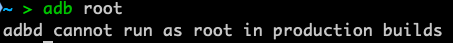
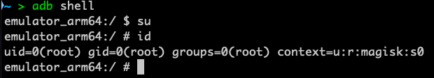
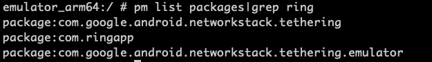

+++
title = 'Cert unpinning with Frida'
date = 2024-09-22T20:45:56-07:00
+++

This guide will enable you to unpin android applications, and forward traffic to a local proxy (i.e. Burp/Caido/Zap) running on port :8080 on your local machine.

**References:**  
https://gist.github.com/teknogeek/4dc35fb3801bd7f13e5f0da5b784c725  
https://gitlab.com/newbit/rootAVD  
https://github.com/frida/frida/releases

&nbsp;

## Prerequisites

- You should be running an emulated device with Play Store enabled.

- You have a rooted device and adb working. If you do not already, follow instructions on https://gitlab.com/newbit/rootAVD

> *Modern versions of android require you to use the "FAKEBOOTIMG" option with rootAVD. More info can be found at the link above. You may need to do a clean boot during the setup like so: `emulator @device_name -no-snapshot-load`*

### To confirm your device is rooted properly:

1.  `adb root` should fail, indicating you're running a production build:  

2.  Connect to your emulator:
```
adb shell
```
3.  Now that you're connected to your device, execute these commands:

```
su
id
```

4. Confirm that you see a #, and you are root:



&nbsp;

# Frida Setup

Frida runs as client/server. The server runs on your android emulator, and the client runs on the PC with adb.

### Client setup

*Requires python3 installed*: 
```
pip3 install frida-tools
```


### Android setup

1. Download the latest frida server from: https://github.com/frida/frida/releases  
`frida-server-XX-android-arm64.xz`

> *frida-server needs to match your Android virtualized hardware, usually arm64. This can be checked with `adb shell getprop ro.product.cpu.abi`*

2.  Unpack the .xz archive.
3.  Move the unpacked frida-server to your android device: 
```
adb push frida-server-XX-android-arm64 /data/local/tmp/frida-server
```
4.  Make frida-server executable: 
```
adb shell chmod 755 /data/local/tmp/frida-server
```

## Setup forwarding to your web proxy

**From the android device:**

Go to Settings -> Network and Internet -> Wi-Fi -> AndroidWifi -> Edit (Pen icon)

```
Proxy hostname: 127.0.0.1
Proxy port: 8080
```

> If you see a notification about the Wifi not having connection, choose 'use anyways'.

> Disabling LTE on the emulator will stop the traffic from going through an alternate interface. This doesn't always matter, but can help make it more reliable.

## Using Frida

1. Connect to your Android device as root:

```
adb shell
su
```

2. Find the name of your application: 

```
pm list packages|grep APPNAME
```


> Here, the app name is 'com.ringapp'

3. Start the daemon: 
```
/data/local/tmp/frida-server -D
```

### Hooking the app

1. Download the universal unpinning script from teknogeek: https://gist.github.com/teknogeek/4dc35fb3801bd7f13e5f0da5b784c725

2.  Hook the local tcp:8080 to your machines' tcp:8080: 
```
adb reverse tcp:8080 tcp:8080
```
> This has to be run every time you restart the emulator

    
3.  Run the frida unpinning script: `frida -U -l ./universalUnpin.js -f com.<appname>`
    

You should now see traffic flowing through your web proxy!

&nbsp;

## Quickstart after reboot

1. Start your emulator:
```
emulator @rooted
```
> Ensure Wifi is on and used as the main network

2. Forward the android port to your local system, and start the Frida daemon:
```
adb reverse tcp:8080 tcp:8080 && adb shell su -c /data/local/tmp/frida-server -D
```
> The daemon will hang your terminal. You can either close the terminal, or open a second to run the next command.

3. Launch the app with the unpinning script:
```
frida -U -l /Users/laptop/Documents/android/universalUnpin.js -f com.<appname>
```